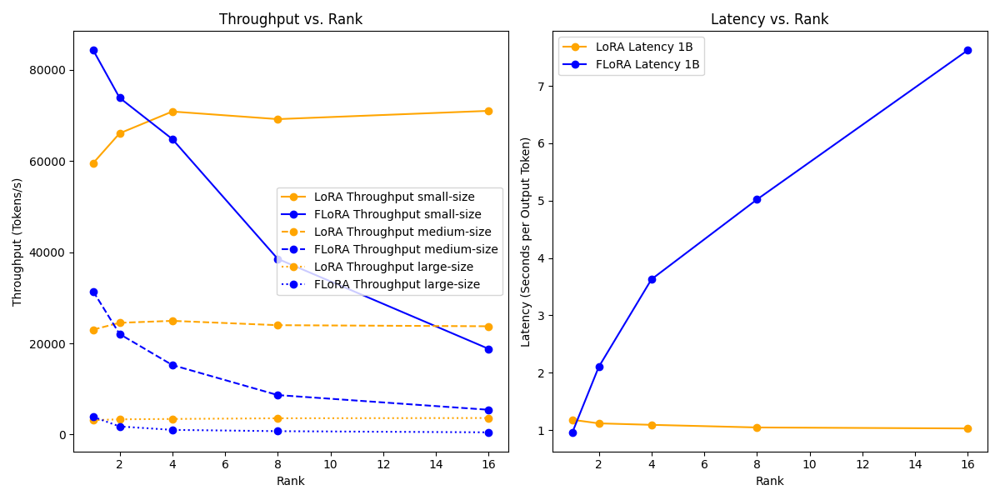

# FLoRA와 LoRA 성능 비교 실험

## 개요
이 프로젝트는 Transformer 모델에서 FLoRA(Fast Low Rank Adaptation)와 LoRA(Low Rank Adaptation)의 성능을 비교합니다. 우리는 다양한 모델 크기와 rank에서 모델의 throughput과 latency을 측정하여 두 방법의 효율성을 평가합니다.

## 실험 결과 해석


`results/results.png` 파일에 저장된 실험 결과는 FLoRA 논문에서 수행한 throughput과 latency 실험과 유사한 패턴을 보여줍니다.

### throughput 분석
논문과 마찬가지로, 모델 크기(small, medium, large)에 따라 FLoRA의 throughput이 점점 향상되는 모습을 보입니다. Large-size 모델의 경우, throughput이 Medium-size와 Small-size 모델보다 높게 나왔습니다. 또한, 모델 크기와 상관없이 FLoRA를 적용할 때는 rank가 커짐에 따라 throughput이 감소하는 경향을 보입니다. 모델 크기가 고정된 경우, LoRA의 throughput과 FLoRA의 throughput이 겹치는 rank 지점은 모델 크기가 커질수록 점점 더 큰 rank로 이동하는 것을 볼 수 있습니다. 이 패턴은 논문에서의 결과와 동일합니다.

### latency 분석
논문과 동일한 패턴을 보여줍니다. FLoRA를 적용할 때는 rank가 커짐에 따라 latency이 늘어나는 반면, LoRA를 적용할 때는 거의 일정한 수준의 latency을 유지합니다.

종합적으로, 구현한 실험에서도 FLoRA는 rank가 작을 때 throughput과 latency이 크게 개선되며, 모델의 크기가 클 때도 throughput이 개선됨을 확인할 수 있습니다. 다만 논문에서는 보다 뚜렷한 결과를 보여주는데, 이는 본 실험에서 진행한 모델의 크기보다 논문에서는 훨씬 더 큰 모델로 실험을 진행했기 때문입니다 (1B, 3B, 15B).

## 실험 재현 환경
다음은 실험을 재현할 수 있는 환경 설정 방법입니다:

### 실험 구성
실험은 세 개의 주요 스크립트로 나뉩니다:
- `layers.py`: FLoRA와 LoRA 레이어 및 Transformer 디코더 레이어의 정의를 포함합니다.
- `utils.py`: 랜덤 데이터 생성, throughput 및 latency 측정, 결과 플롯을 위한 유틸리티 함수가 포함되어 있습니다.
- `main.py`: 실험을 실행하고 모델을 실행하며 결과 플롯을 생성하는 메인 스크립트입니다.

### 환경 설정
1. Python 버전: 3.10
2. 필요한 패키지:
    - torch==2.3.1
    - tqdm==4.66.4
    - matplotlib==3.9.1
    - numpy==1.26.3

위 패키지를 설치한 후, 터미널에서 다음 명령어를 실행하여 실험을 수행하세요:
(argparse의 resutl_path만 local path로 지정해주세요.)

```bash
python main.py